# Subagent Guild - System Design Document

## Overview

The Subagent Guild is a centralized web service designed to discover, evaluate, and manage Claude Code subagents from multiple public Git repositories. The system provides an intelligent marketplace-style platform that aggregates, categorizes, and simplifies the evaluation and integration of Claude Code subagents for developers.

### Key Features
- Multi-repository subagent aggregation via Git submodules
- Intelligent classification using Claude local prompting
- Two-row layout browser for intuitive navigation
- Side-by-side agent comparison functionality
- One-click package download and integration
- GitHub repository metadata enrichment

### Technology Classification
This is a **Full-Stack Application** - combining backend data processing with frontend user interface components.

## Architecture

### System Architecture Overview

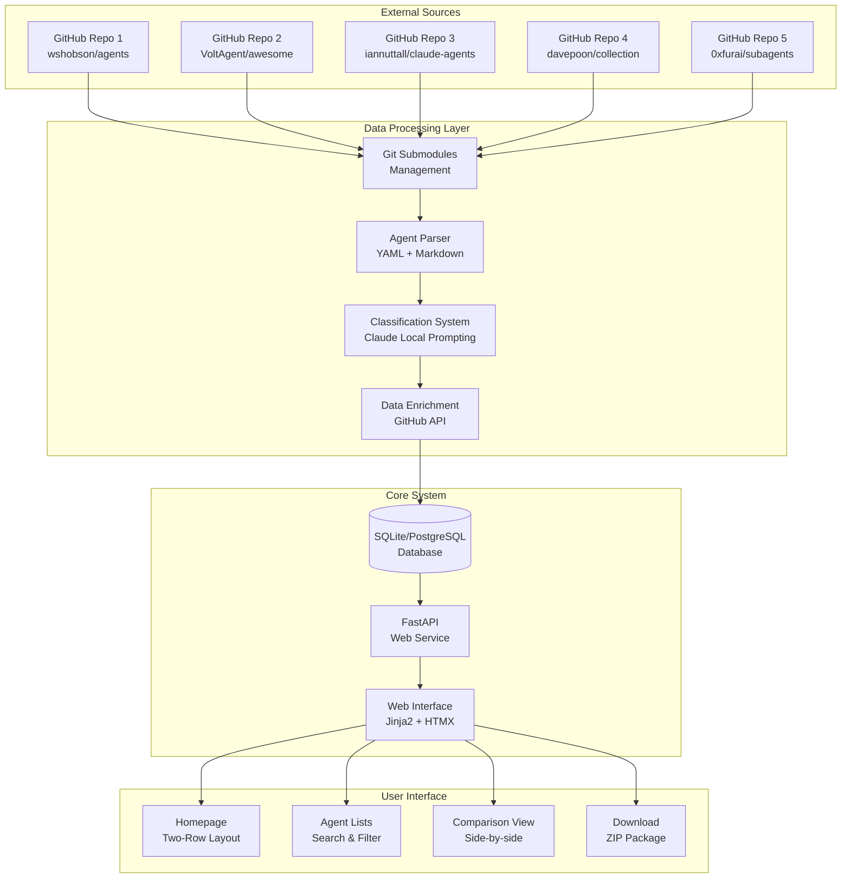

### Script-Driven Monolith Pattern

The system follows separation between online services and offline processing:

#### Online Services (FastAPI)
- Serve database content to users
- API endpoints for agent discovery
- Web interface rendering
- Real-time search and filtering
- Package generation and download

#### Offline Processing (Python Scripts)
- Data ingestion and processing
- Git repository synchronization
- Agent parsing and classification
- External data enrichment
- Database updates

## Frontend Architecture

### Component Hierarchy

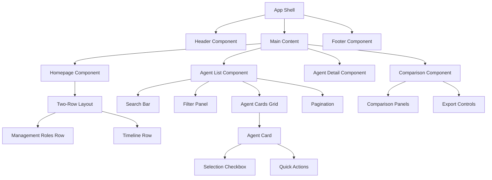

### State Management

Hybrid approach combining server-side rendering with client-side interactivity:

#### Server-Side State (Jinja2 Templates)
- Initial page rendering
- SEO-friendly content
- Form handling and validation

#### Client-Side State (HTMX + Vanilla JS)
- Dynamic filtering and search
- Agent selection management
- Comparison panel updates
- Download preparation

### User Experience Design

#### Progressive Filter Interface

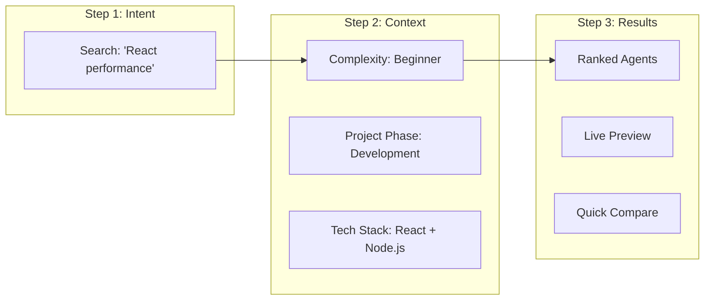

#### Agent Discovery Flow

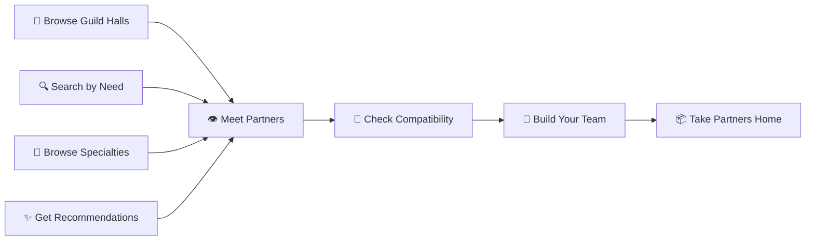

## Backend Architecture

### Data Models & Database Design

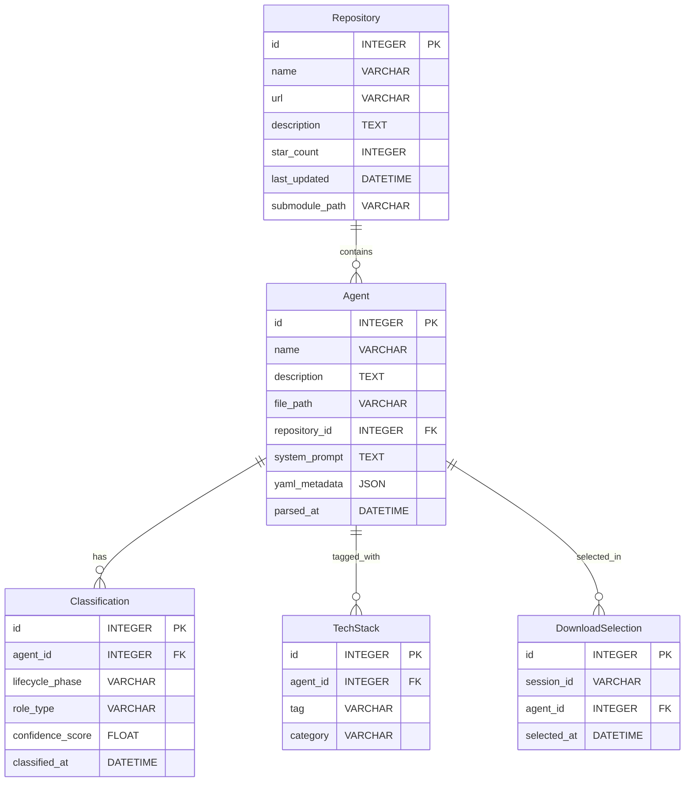

### Classification Hierarchy

```mermaid
graph TD
    LP[Lifecycle Phases<br/>7 Categories]
    RT[Role Types<br/>27 Categories]
    TS[Tech Stack<br/>Technology Tags]
    
    LP --> LP1[Across All Lifecycle]
    LP --> LP2[Concept Planning]
    LP --> LP3[Design Architecture]
    LP --> LP4[Development Implementation]
    LP --> LP5[Testing QA]
    LP --> LP6[Deployment Release]
    LP --> LP7[Operations Optimization]
    
    RT --> RT1[Product Manager]
    RT --> RT2[System Architect]
    RT --> RT3[Backend Developer]
    RT --> RT4[Performance Engineer]
    RT --> RT5[...]
    
    TS --> TS1[General]
    TS --> TS2[Performance Optimization]
    TS --> TS3[System Design]
    TS --> TS4[Go, Python, React...]
```

### API Endpoints Reference

#### Agent Discovery

| Method | Endpoint | Purpose |
|--------|----------|---------|
| GET | `/api/agents` | Retrieve filtered list of agents |
| GET | `/api/agents/{agent_id}/related` | Get related agents for discovery |
| GET | `/api/agents/popular` | Get most downloaded agents |

#### Comparison and Download

| Method | Endpoint | Purpose |
|--------|----------|---------|
| POST | `/api/agents/compare` | Compare multiple agents side-by-side |
| POST | `/api/download/package` | Generate ZIP package of selected agents |

#### Repository Management

| Method | Endpoint | Purpose |
|--------|----------|---------|
| GET | `/api/repositories` | List all configured repositories |
| POST | `/api/repositories/sync` | Trigger repository synchronization |

## Business Logic Layer

### Agent Discovery Workflow

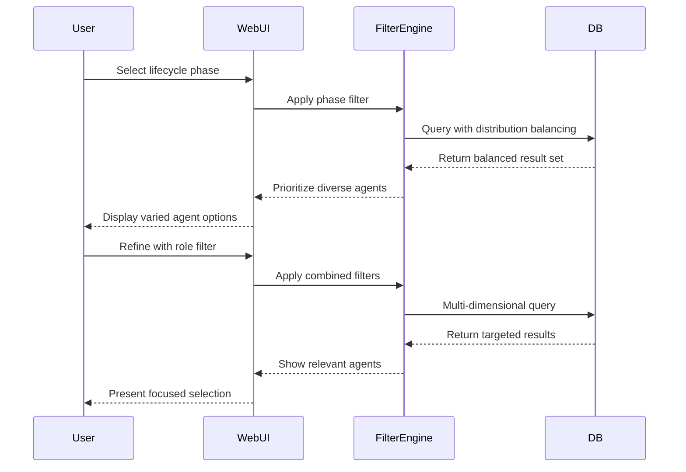

### Classification Processing Workflow

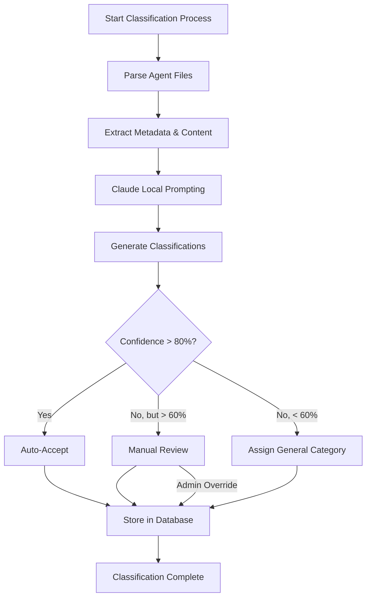

### Package Generation Workflow

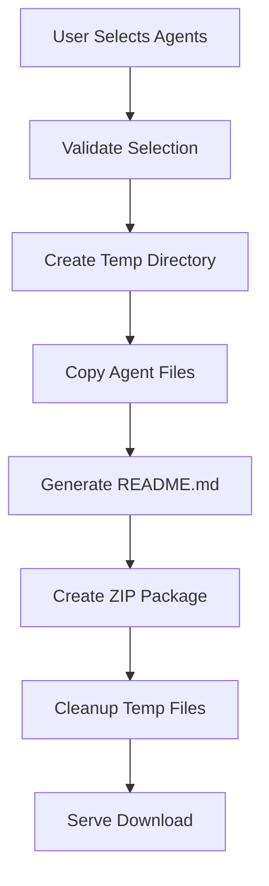

## Data Flow Architecture

### Repository Synchronization Flow

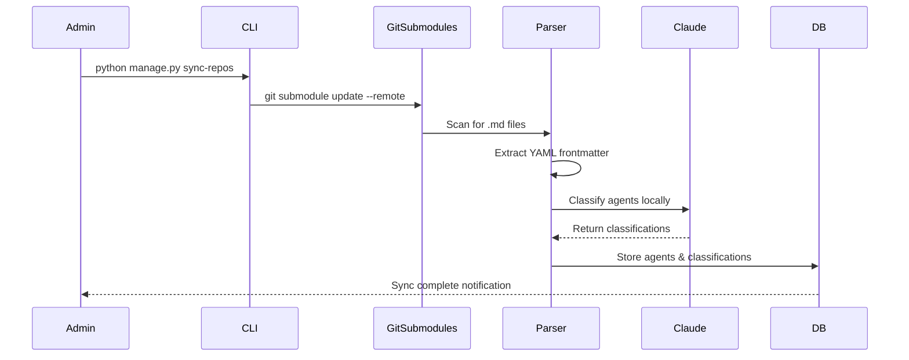

### User Interaction Flow

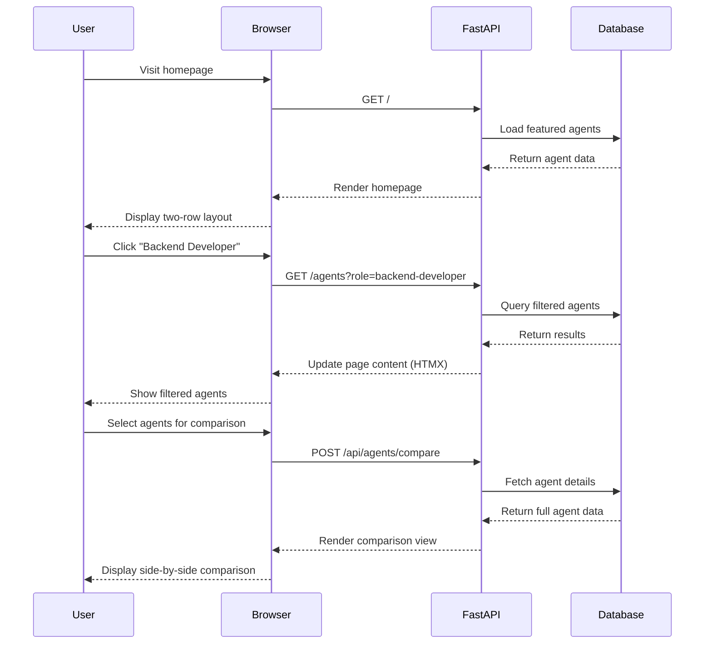

## Testing Strategy

### Unit Testing
- **Parser Components**: YAML extraction, content validation
- **Classification Logic**: Claude integration, confidence scoring  
- **API Endpoints**: Request/response handling, input validation
- **Business Logic**: Filtering, sorting, comparison algorithms

### Integration Testing
- **Database Operations**: CRUD operations, complex queries
- **External APIs**: GitHub API integration, rate limiting
- **File System**: Git submodule operations, file parsing

### End-to-End Testing  
- **User Workflows**: Complete discovery and download flows
- **Browser Compatibility**: HTMX interactions, responsive design
- **Performance**: Load times, search responsiveness